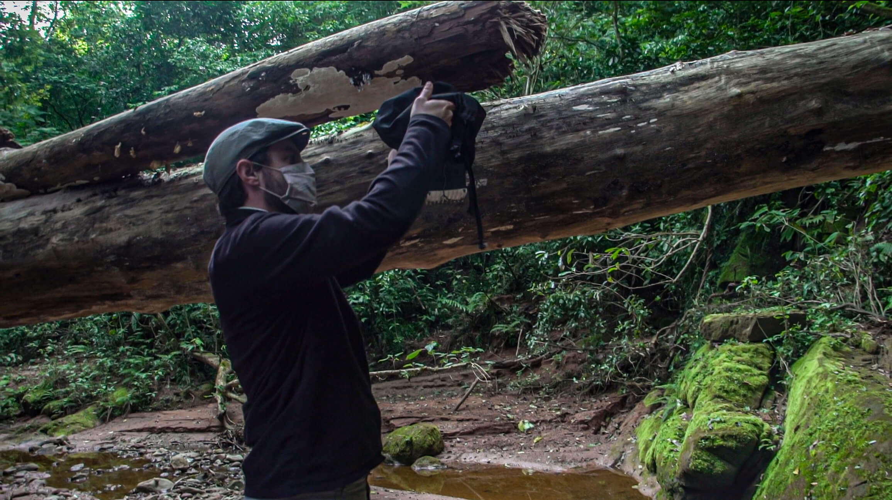
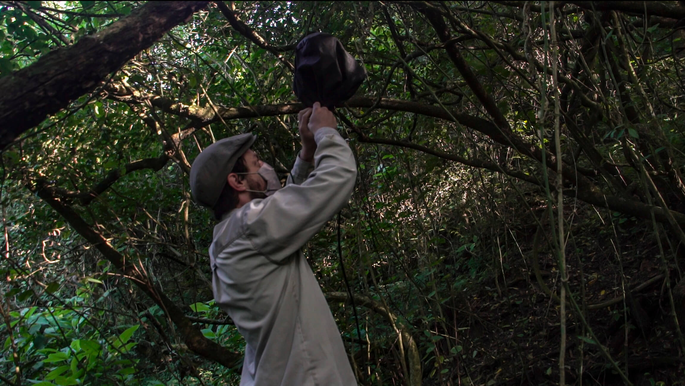
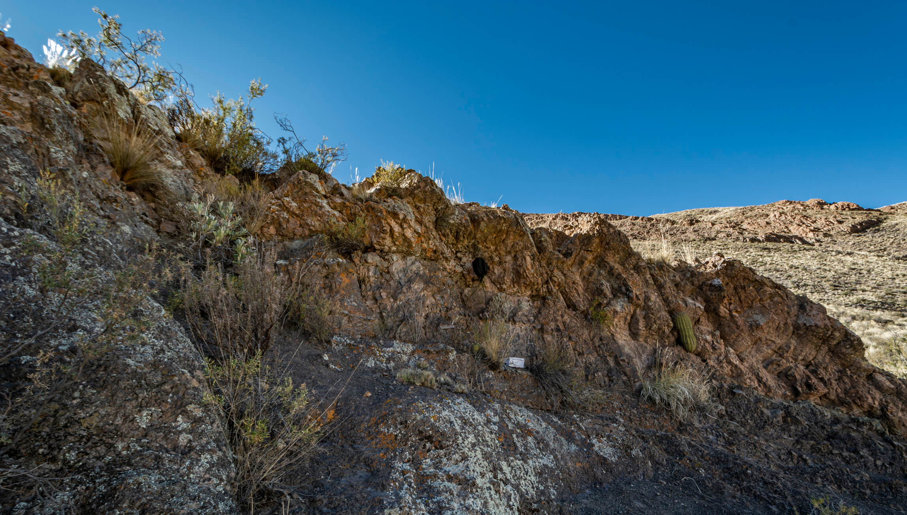
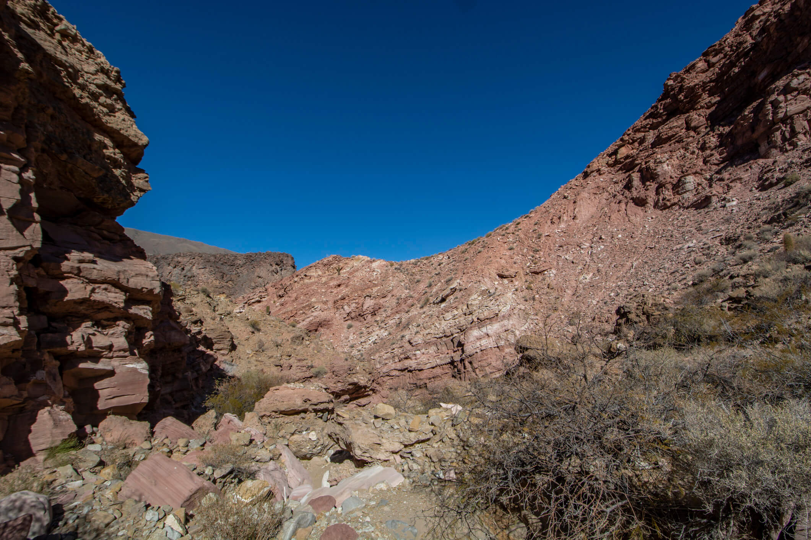

```{r setup, include=FALSE}
knitr::opts_chunk$set(echo = TRUE)
library(tidyverse)
library(lubridate)
library(ggeasy)
```

## Resumen

Se propone el análisis estadistico de tres indices bioacústicos (BI, ACI y ADI) realizados en cuatro locaciones correspondientes a dos regiones (Puna y Yungas) del noroeste argentino. Los resultados obtenidos fueron comparados con el trabajo realizado por ... en ... 

## Indices de Analisis y Trabajo de Referencia

Se realizó un trabajo de analisis a partir de 3 indicadores de actividad bioacústica:

El **Indice Bioacústico (BI)** se presenta como una medida de la abundancia de aves y se calcula simplemente como el área espectral de frecuencia media. 
Se utilizó para investigar las diferencias entre especies exóticas y nativas en Hawái y se demostró que está fuertemente correlacionada con los recuentos de un estudio ornitológico directo cuando se calcula para muestras individuales tomadas durante un período de seis semanas.
Una función tanto de la amplitud como del número de bandas de frecuencia ocupadas entre 2 y 8 kHz. 
El valor es relativo a la banda de frecuencia más silenciosa de 1 kHz; los valores más altos indican una mayor disparidad entre las bandas más ruidosas y más silenciosas.

Fuentes: 
[Bradfer-Lawrence, et al. *Guidelines for the use of acoustic indices in environmental research*](https://drive.google.com/file/d/1O6n8GeyN0kNR8tdMw3Ed_a2Ez2MkEQiF/view?usp=sharing)
[Boelman, et al. *Multi-trophic invasion resistance in Hawaii: bioacoustics, field surveys, and airborne remote sensing. Ecological Applications*](https://drive.google.com/file/d/1qP99FpZyJOXm1I4VYBuPLnbSof5YHzaU/view?usp=sharing)

____________________________________________________________________
         
El **Índice de Complejidad Acústica (ACI)**, produce una cuantificación directa y rápida del canto de las aves procesando las intensidades registradas en los archivos de audio.
La fuerte correlación entre el ACI y la actividad de canto de la comunidad aviar está relacionada con la capacidad de este índice para resaltar con éxito variaciones rápidas de intensidad en cada intervalo de frecuencia, una característica que es típica del canto de los pájaros.
En contraste, otros sonidos parecidos a planos, como el zumbido de insectos u otro ruido antropogénico, se caracterizan por niveles de intensidad aproximadamente constantes, que producen valores de ACI muy pequeños.
         
Fuente: 
[Farina. A, et al. *The Application of the Acoustic Complexity Indices (ACI) to Ecoacoustic Event Detection and Identification (EEDI) Modeling*](https://drive.google.com/file/d/1O6n8GeyN0kNR8tdMw3Ed_a2Ez2MkEQiF/view?usp=sharing)

____________________________________________________________________


El **Indice de Diversidad Acústica (ADI)** hace mención al Índice de diversidad, uniformidad y dominio de las bandas de frecuencia.
Este Indice Aumenta con mayor uniformidad en las bandas de frecuencia. Una señal uniforme (ya sea ruidosa en todas las bandas de frecuencia o completamente silenciosa) dará un valor alto, mientras que un tono puro (es decir, toda la energía en una banda de frecuencia) estará más cerca de 0. 
        
Fuentes: 
[Rajan, et al. *Rapid assessment of biodiversity using acoustic indices*](https://link.springer.com/article/10.1007/s10531-018-1673-0)

___________________________________________________________________________________

Se toma como referencia el trabajo de 

[Ross, et al. *Listening to ecosystems: data-rich acoustic monitoring through landscape-scale sensor networks*](https://www.researchgate.net/publication/320041743_Listening_to_ecosystems_data-rich_acoustic_monitoring_through_landscape-scale_sensor_networks)

## Estructura de los datos

Los datos fueron obtenidos a partir de una serie de pruebas de campo realizadas por los autores mediante un sistema de desarrollo propio denominado [**Sentinel**](https://www.researchgate.net/publication/354010172_Sentinel_Versatile_real-time_acoustic_autonomous_monitoring_system_for_studying_natural_soundscapes).
El repositorio completo de los materiales obtenidos estan disponibles en [GitHub](https://github.com/damianpayo/sentinel_data).


Los datos relevados contemplan dos locaciones en la Reserva Natural **La Poma** (Acay y Cavernas) y dos locaciones en la Reserva Natural **Acambuco** (Mayuato y Quebrada de Astilleros). La Poma se encuentra en la region de la Puna, y Acambuco en la selva Yunga.

```{r}

# MAPA

```

Acay es un lugar que corresponde a una cordillera de 3511 metros sobre el nivel del mar. Clima seco de matorrales secos y bajos (valles y matorrales de Puno), vientos fuertes. Durante el período de registro, el rango de temperatura fue de -3° C a 6° C, la humedad 20-40% y vientos entre 25 y 35 km/h. La hora del atardecer fue a las 18:53.

Quebrada Astilleros corresponde a un conjunto de sierras y yungas con alta diversidad (Selvas Pedemontana y Selva Montana) y 715 msnm. Su clima es templado cálido, lluvioso moderado, con un invierno seco no riguroso. El rango de temperatura fue de 7° a 18° C, la humedad 50-85% y vientos entre 5 y 25 km/h. La puesta del sol fue a las 18:41

FALTAN LOS OTROS DOS LUGARES

<div>
<p style = 'text-align:center;'>


</p>
<p style = 'text-align:center;'>



<p style = 'text-align:center;'>
**Imagen 1**: Locaciones donde fueron realizadas las grabaciones. <br>
Arriba: Acambuco: Sendero Mayuato (Izq), Quebrada de Astilleros (Der). Abajo: La Poma: Acay (Izq), Cavernas (Der)
</div>

El registro original comprende 10 horas en Quebrada de Astilleros (de 17:00 a 3:00), 10 horas en Sendero Mayuato (de 10:00 a 21:00), 16 horas en Acay (de 11:00 a 3:00), y 18 horas en Cavernas (de 16:00 a 10:00). Todas las grabaciones se realizaron en Mayo del 2021.

El sistema Sentinel relevó un archivo de audio cada 60 segundos. Es decir, se obtuvieron 12 observaciones cada 60 segundos (3 indices x 4 locaciones).

Para llevar a cabo una comparacion mas controlada, se tomo el mismo periodo de tiempo de 4 horas en cada locacion, mas precisamente de 17 a 21hs. Este lapso nos es particularmente de interes ya que contempla una fraccion con luz solar y otra ya de noche.

De los datos originales obtenidos en formato .csv fue preciso: 
  - Agregar una fila (header) con cada indice
  - Filtrar, de todos los indices obtenidos, sólo los tres a evaluar.
  - Realizar un filtrado de 4 horas por locación, entre 17 y 21hs.
  - Modificar el formato de Fecha y Hora con la libreria 'lubridate'.

```{r}

#Carga de planillas .csv

Cavernas <- read_csv(file = './07-05-2021_Cavernas.csv')
Mayuato <- read_csv(file = './23-05-21_Sendero_Mayuato.csv')
Astilleros <- read_csv(file = './23-05-21_Quebrada_de_Astilleros.csv')
Acay <- read_csv(file = './08-05-2021_Acay.csv')

#Diseño de fila header

names (Cavernas) <- c('Dates', 'ACI', 'BI', 'DNSI', 'AEI', 'ADI', 'HS', 'HT', 'SC', 'dBFS')
names (Mayuato) <- c('Dates', 'ACI', 'BI', 'DNSI', 'AEI', 'ADI', 'HS', 'HT', 'SC', 'dBFS')
names (Astilleros) <- c('Dates', 'ACI', 'BI', 'DNSI', 'AEI', 'ADI', 'HS', 'HT', 'SC', 'dBFS')
names (Acay) <- c('Dates', 'ACI', 'BI', 'DNSI', 'AEI', 'ADI', 'HS', 'HT', 'SC', 'dBFS')

# Filtrar

Cavernas <- Cavernas %>%
  select(c('Dates', 'ACI', 'ADI', 'BI'))

Mayuato <- Mayuato %>%
  select(c('Dates', 'ACI', 'ADI', 'BI'))

Astilleros <- Astilleros %>%
  select(c('Dates', 'ACI', 'ADI', 'BI'))

Acay <- Acay %>%
  select(c('Dates', 'ACI', 'ADI', 'BI'))

# Modificar el formato de Fecha Hora

Cavernas %<>% filter(Dates>ymd_hms("2021:05:07 17:00:00")) %>% 
  filter(Dates<ymd_hms("2021:05:07 21:00:00"))
Mayuato %<>% filter(Dates>ymd_hms("2021:05:21 17:00:00")) %>% 
  filter(Dates<ymd_hms("2021:05:21 21:00:00"))
Astilleros %<>% filter(Dates>ymd_hms("2021:05:23 17:00:00")) %>% 
  filter(Dates<ymd_hms("2021:05:23 21:00:00"))
Acay %<>% filter(Dates>ymd_hms("2021:05:08 17:00:00")) %>% 
  filter(Dates<ymd_hms("2021:05:08 21:00:00"))

#Cambio el dia

Cavernas %<>% mutate(Dates= hm(format(Dates,"%H:%M"))) %>%
  mutate(Dates= ymd_hms(paste("2021:01:01 ",as.character(Dates@hour),":",as.character(Dates@minute), ":0")))
Mayuato %<>% mutate(Dates= hm(format(Dates,"%H:%M"))) %>%
  mutate(Dates= ymd_hms(paste("2021:01:01 ",as.character(Dates@hour),":",as.character(Dates@minute), ":0")))
Astilleros %<>% mutate(Dates= hm(format(Dates,"%H:%M"))) %>%
  mutate(Dates= ymd_hms(paste("2021:01:01 ",as.character(Dates@hour),":",as.character(Dates@minute), ":0")))
Acay %<>% mutate(Dates= hm(format(Dates,"%H:%M"))) %>%
  mutate(Dates= ymd_hms(paste("2021:01:01 ",as.character(Dates@hour),":",as.character(Dates@minute), ":0")))
```

Finalmente se realizó un solo tibble con los datos de las cuatro locaciones con sus indices, agregando una columna que contenga el nombre de cada locación.

```{r}

Datos <- Cavernas %>% mutate(lugar = "Cavernas") %>% 
  bind_rows(Mayuato %>% mutate(lugar = "Mayuato")) %>% 
  bind_rows(Astilleros %>% mutate(lugar = "Astilleros")) %>% 
  bind_rows(Acay %>% mutate(lugar = "Acay"))

Datos
```

Se exponen los resultados obtenidos en las cuatro locaciones para cada indice.

```{r}
graph_BI_Tiempo <- ggplot(data=Datos, aes(x=Dates, y=BI, group=lugar, color=lugar)) +
  geom_line()+
  theme_minimal() +
  labs(title = 'Indice Bioacústico (BI)', x = 'Hora', colour = 'Locación') +
  ggeasy::easy_center_title()

graph_BI_Tiempo
```

```{r}
graph_ACI_Tiempo <- ggplot(data=Datos %>% filter(ACI<300), aes(x=Dates, y=ACI, group=lugar, color=lugar)) +
  geom_line()+
  theme_minimal() +
  labs(title = 'Índice de Complejidad Acústica (ACI)', x = 'Hora', colour = 'Locación') +
  ggeasy::easy_center_title()
graph_ACI_Tiempo
```

```{r}
graph_ADI_Tiempo <- ggplot(data=Datos, aes(x=Dates, y=ADI, group=lugar, color=lugar)) +
  geom_line()+
  theme_minimal() +
  labs(title = 'Indice de Diversidad Acústica (ADI)', x = 'Hora', colour = 'Locación') +
  ggeasy::easy_center_title()
graph_ADI_Tiempo
```

Grafico tipo boxplot sin contemplar el tiempo

HIPOTESIS

ANALISIS


