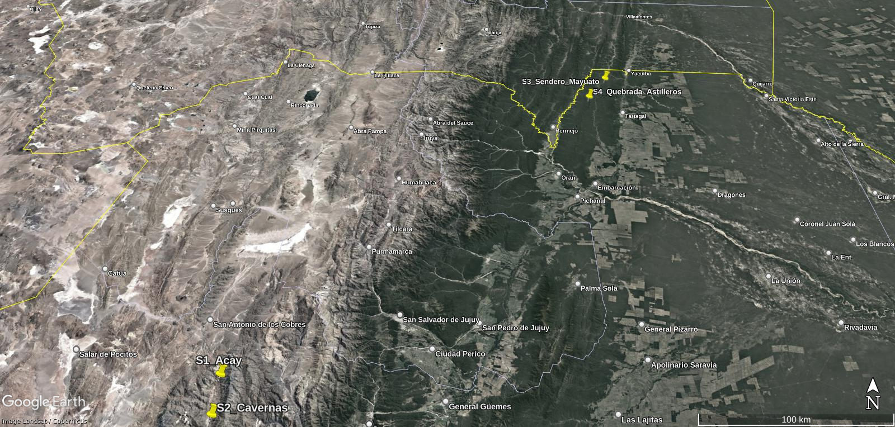
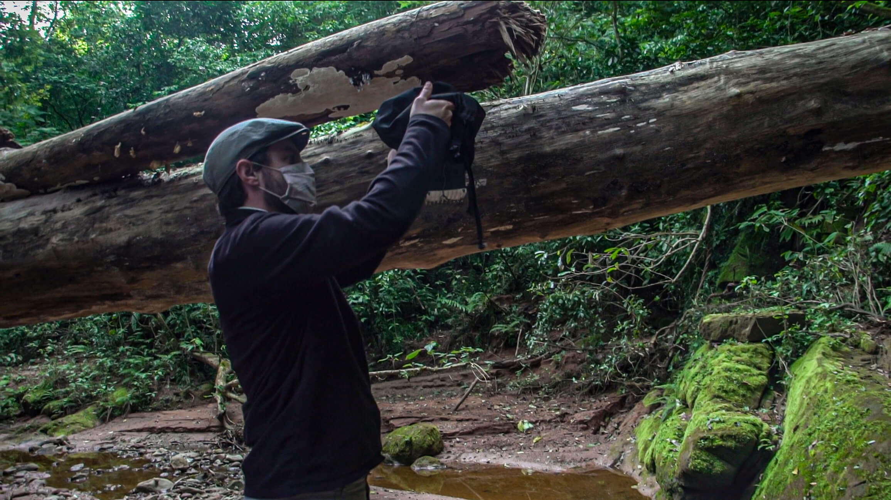
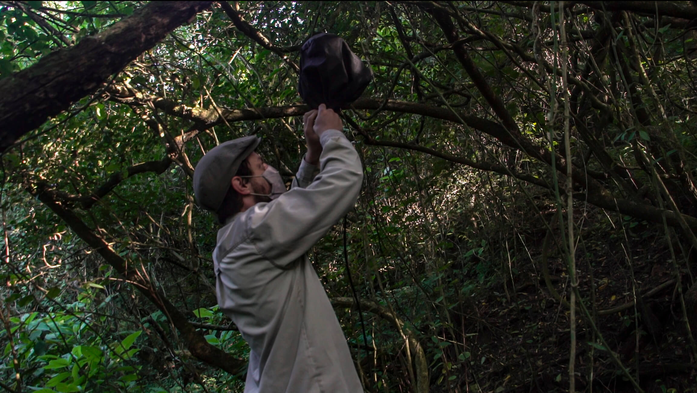
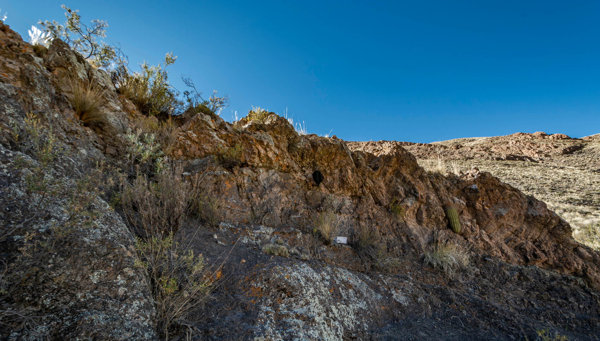

```{r setup, include=FALSE}
knitr::opts_chunk$set(echo = TRUE)
library(tidyverse)
library(lubridate)
library(ggeasy)
library(corrplot)
library(Routliers)
library(ggpubr)
library(patchwork)
library(here)
```

## RESUMEN

Se propone el análisis estadistico de dos indices bioacústicos (ACI y
ADI) realizados en cuatro locaciones correspondientes a dos regiones
(Puna y Yungas) del noroeste argentino. Los resultados obtenidos fueron
comparados según locación a partir de una districión uniforme y por
franja horaria (dia/noche), teniendo en cuenta modelos de regresión
lineal.

## DATOS

### Indices de Análisis

Se realizó un trabajo de analisis a partir de 2 indicadores de actividad
bioacústica:

El **Índice de Complejidad Acústica (ACI)**, produce una cuantificación
directa y rápida del canto de las aves procesando las intensidades
registradas en los archivos de audio. La fuerte correlación entre el ACI
y la actividad de canto de la comunidad aviar está relacionada con la
capacidad de este índice para resaltar con éxito variaciones rápidas de
intensidad en cada intervalo de frecuencia, una característica que es
típica del canto de los pájaros. En contraste, otros sonidos parecidos a
planos, como el zumbido de insectos u otro ruido antropogénico, se
caracterizan por niveles de intensidad aproximadamente constantes, que
producen valores de ACI muy pequeños.

Fuente: [Farina. A, et al. *The Application of the Acoustic Complexity
Indices (ACI) to Ecoacoustic Event Detection and Identification (EEDI)
Modeling*](https://drive.google.com/file/d/1O6n8GeyN0kNR8tdMw3Ed_a2Ez2MkEQiF/view?usp=sharing)

------------------------------------------------------------------------

El **Indice de Diversidad Acústica (ADI)** hace mención al Índice de
diversidad, uniformidad y dominio de las bandas de frecuencia. Este
Indice Aumenta con mayor uniformidad en las bandas de frecuencia. Una
señal uniforme (ya sea ruidosa en todas las bandas de frecuencia o
completamente silenciosa) dará un valor alto, mientras que un tono puro
(es decir, toda la energía en una banda de frecuencia) estará más cerca
de 0.

Fuentes: [Rajan, et al. *Rapid assessment of biodiversity using acoustic
indices*](https://link.springer.com/article/10.1007/s10531-018-1673-0)

### Estructura de los datos

Los datos fueron obtenidos a partir de una serie de pruebas de campo
realizadas por los autores mediante un sistema de desarrollo propio
denominado
[**Sentinel**](https://www.researchgate.net/publication/354010172_Sentinel_Versatile_real-time_acoustic_autonomous_monitoring_system_for_studying_natural_soundscapes).
El repositorio completo de los materiales obtenidos estan disponibles en
[GitHub](https://github.com/damianpayo/sentinel_data).

Los datos relevados contemplan dos locaciones en la Reserva Natural **La
Poma** (Acay y Cavernas) y dos locaciones en la Reserva Natural
**Acambuco** (Mayuato y Quebrada de Astilleros).

<div>

<p style="text-align:center;">



</p>

**Fig 1**: Mapa de Puntos Registrados

<div>

<br> Acay y Cavernas, pertenecen al Area Natural Protegida **La Poma**:
una cordillera de 3511 metros sobre el nivel del mar, clima seco de
matorrales secos y bajos (valles y matorrales de Puno) y vientos
fuertes. Durante el período de registro, el rango de temperatura fue de
-3° C a 6° C, la humedad 20-40% y vientos entre 25 y 35 km/h. La caida
del sol fue a las 18:53.

Quebrada Astilleros y Mayuuatos, corresponden a la Reserva Natural
**Acambuco**: conjunto de sierras y yungas con alta diversidad (Selvas
Pedemontana y Selva Montana) y 715 msnm. Su clima es templado cálido,
lluvioso moderado, con un invierno seco no riguroso. El rango de
temperatura fue de 7° a 18° C, la humedad 50-85% y vientos entre 5 y 25
km/h. La caida del sol fue a las 18:41

<div>

<p style="text-align:center;">




</p>

<p style = 'text-align:center;'>




<p style = 'text-align:center;'>

**Fig 2**: Locaciones donde fueron realizadas las grabaciones. <br>
Arriba: Acambuco: Sendero Mayuato (Izq), Quebrada de Astilleros (Der).
Abajo: La Poma: Acay (Izq), Cavernas (Der)

</div>

### Manipulación de Datos

El registro original comprende 10 horas en Quebrada de Astilleros (de
17:00 a 3:00), 10 horas en Sendero Mayuato (de 10:00 a 21:00), 16 horas
en Acay (de 11:00 a 3:00), y 18 horas en Cavernas (de 16:00 a 10:00).
Todas las grabaciones se realizaron en Mayo del 2021.

Asimismo, de cada muestra se midieron 9 indices: <br>- Indice de
Diversidad Acústica (ACI) <br> - Indice Bioacústico (BI) <br> - Índice
de Diferencia Normalizada de Paisaje Sonoro (DNSI) <br> - Indice de
Igualdad Acústica (AEI) <br> - Indice de Diversidad Acústica (ADI)
<br> - Entropía Espectral (HS) <br> - Entropía Temporal (HT) <br> -
Centroide Espectral (SC) <br> - Decibeles Full Scale (dBFS) <br>

El sistema Sentinel relevó un archivo de audio cada 60 segundos. Es
decir, se obtuvieron 36 observaciones cada 60 segundos (9 indices x 4
locaciones).

Previamente se realizó un analisis de correlación de parametros para
determinar el comportamiento de los mismos.<br> Para responder a la
hipotesis planteada, se decidió tomar los indicadores ACI y ADI, ya que
el primero se focaliza en la variación temporal de la intensidad (ACI)
mientras que el segundo, en las varaciones de intensidad por bandas de
frecuencia (ADI).

```{r, message=FALSE}
#Carga de planillas .csv

rm(list = ls())

Cavernas <- read_csv(file = here('datos','07-05-2021_Cavernas.csv')) %>% mutate(region = "Puna", lugar = "Cavernas", .before=1)
Mayuato <- read_csv(file = here('datos','23-05-2021_Sendero_Mayuato.csv')) %>% mutate(region = "Yunga", lugar = "Mayuato", .before=1)
Astilleros <- read_csv(file = here('datos','23-05-2021_Quebrada_de_Astilleros.csv')) %>% mutate(region = "Yunga", lugar = "Astilleros", .before=1)
Acay <- read_csv(file = here('datos','08-05-2021_Acay.csv')) %>% mutate(region = "Puna", lugar = "Acay", .before=1)

# Unificación de datos

Ind <- Cavernas %>% 
  bind_rows(Mayuato) %>% 
  bind_rows(Astilleros) %>% 
  bind_rows(Acay)

```

```{r,  fig.align ='center', message=FALSE}
# Grafica de Correlación

Indices <- Ind %>% select(ACI, BI, DNSI, AEI, ADI, HS, HT, SC, dBFS)
Indices_cor <- cor(Indices)
corrplot.mixed(Indices_cor)
```

**fig 3**: Gráfica comparativa de correlación de los parámetros
analizados.<br> Pueden observarse comportamientos directamente
correlacionados entre HS-ADI, SC-DNSI, SC-HS.<br> Pueden observarse
comportamientos inversamente correlacionados entre ADI-AEI, SC-dBFS,
dBFS-HS, BI-HT.<br>

Para llevar a cabo una comparacion mas controlada, se tomó el mismo
período de tiempo de 4 horas en cada locación, mas precisamente de 17 a
21hs. Este lapso nos es particularmente de interes ya que contempla una
fraccion con luz solar y otra ya de noche.

De los datos originales obtenidos en formato .csv fue preciso: <br> -
Agregar una fila (header) con cada indice <br> - Filtrar, de todos los
indices obtenidos, sólo los dos a evaluar. <br> - Realizar un filtrado
de 4 horas por locación, entre 17 y 21hs. <br> - Modificar el formato de
Fecha y Hora con la librería 'lubridate'.

```{r, fig.align ='center', message=FALSE}

# Filtrar

Cavernas <- Cavernas %>%
  select(c('region','lugar','Dates', 'ACI', 'ADI'))

Mayuato <- Mayuato %>%
  select(c('region','lugar','Dates', 'ACI', 'ADI'))

Astilleros <- Astilleros %>%
  select(c('region','lugar','Dates', 'ACI', 'ADI'))

Acay <- Acay %>%
  select(c('region','lugar','Dates', 'ACI', 'ADI'))

# Modificar el formato de Fecha Hora

Cavernas %<>% filter(Dates>ymd_hms("2021:05:07 17:00:00")) %>% 
  filter(Dates<ymd_hms("2021:05:07 21:00:00"))
Mayuato %<>% filter(Dates>ymd_hms("2021:05:21 17:00:00")) %>% 
  filter(Dates<ymd_hms("2021:05:21 21:00:00"))
Astilleros %<>% filter(Dates>ymd_hms("2021:05:23 17:00:00")) %>% 
  filter(Dates<ymd_hms("2021:05:23 21:00:00"))
Acay %<>% filter(Dates>ymd_hms("2021:05:08 17:00:00")) %>% 
  filter(Dates<ymd_hms("2021:05:08 21:00:00"))

#Cambio el dia

Cavernas %<>% mutate(Dates= hm(format(Dates,"%H:%M"))) %>%
  mutate(Dates= ymd_hms(paste("2021:01:01 ",as.character(Dates@hour),":",as.character(Dates@minute), ":0")))
Mayuato %<>% mutate(Dates= hm(format(Dates,"%H:%M"))) %>%
  mutate(Dates= ymd_hms(paste("2021:01:01 ",as.character(Dates@hour),":",as.character(Dates@minute), ":0")))
Astilleros %<>% mutate(Dates= hm(format(Dates,"%H:%M"))) %>%
  mutate(Dates= ymd_hms(paste("2021:01:01 ",as.character(Dates@hour),":",as.character(Dates@minute), ":0")))
Acay %<>% mutate(Dates= hm(format(Dates,"%H:%M"))) %>%
  mutate(Dates= ymd_hms(paste("2021:01:01 ",as.character(Dates@hour),":",as.character(Dates@minute), ":0")))
```

Finalmente se realizó un solo tibble con los datos de las cuatro
locaciones con sus índices, agregando una columna que contenga el nombre
de cada locación.

```{r, message=FALSE}

Datos <- Cavernas %>% 
  bind_rows(Mayuato) %>% 
  bind_rows(Astilleros) %>% 
  bind_rows(Acay)
```

### Outliers

Para determinar los outliers utilizamos el metodo MAD, a partir de la
libreria Routliers. Exponemos una grafica Boxplot donde se exponen las
muestras eliminadas.

```{r, fig.align ='center', message=FALSE}
summary(Datos)

# Determinación de Outliers ACI

outliers_mad(Acay$ACI)

outliers_mad(Cavernas$ACI)

outliers_mad(Mayuato$ACI)

outliers_mad(Astilleros$ACI)

#Sumamos una columna con la determnación de outliers TRUE or FALSE

Acay<-Acay %>% mutate(outlier_ACI= ACI<240.6558 | ACI>243.5202)
Cavernas <- Cavernas %>% mutate(outlier_ACI= ACI<241.5485|ACI>243.7635)
Mayuato <- Mayuato %>% mutate(outlier_ACI= ACI<243.8208|ACI>246.6852)
Astilleros <- Astilleros %>% mutate(outlier_ACI= ACI<240.4218|ACI>249.0372)

# Armamos un solo Tibble con todos los lugares.

Datos <- Cavernas %>% 
  bind_rows(Mayuato) %>% 
  bind_rows(Astilleros) %>% 
  bind_rows(Acay)

Datos_ACI <- Datos %>%  filter(outlier_ACI==FALSE) %>%
  select(-c("ADI","outlier_ACI"))

# Graficamos las observaciones ACI con outliers.

ACI_boxplot <- ggplot() +
  stat_boxplot(geom = "errorbar", # Bigotes
              width = 0.2) +
  geom_boxplot(data=Datos%>%filter(ACI<300), aes(x=lugar, y=ACI, color=lugar),
               width = 0.5, outlier.alpha = 0, show.legend = FALSE) +
  geom_jitter(data=Datos%>%filter(outlier_ACI==TRUE, ACI<300),
              aes(x=lugar, y=ACI), color="black",
              position=position_jitter(0.1), 
              size=0.8, alpha=0.5, pch=19)+
  labs(title = 'Datos ACI con Outliers',
       y='ACI',
       x='Locaciones') +
  theme_minimal()

# Graficamos las observaciones ACI sin outliers. 

ACI_boxplot_sinO <- Datos_ACI%>% 
  ggplot(aes(x=lugar, y=ACI, color=lugar))+
  geom_boxplot(width = 0.5, outlier.alpha = 0.5, show.legend = FALSE)+
  labs(title = 'Datos ACI sin Outliers',
       y='ACI',
       x='Locaciones') +
  theme_minimal()
ACI_boxplot + ACI_boxplot_sinO

```

**Fig 4**: Observaciones del parametro ACI para todas las
locaciones.<br> Puede observarse a la izquierda (puntos negros) los
valores con outliers, y a la derecha los valores sin outliers.

```{r, fig.align ='center', message=FALSE}

# Determinación de Outliers ADI

outliers_mad(Acay$ADI)

outliers_mad(Cavernas$ADI)

outliers_mad(Mayuato$ADI)

outliers_mad(Astilleros$ADI)

#Sumamos una columna con la determnación de outliers TRUE or FALSE

Acay<-Acay %>% mutate(outlier_ADI= ADI<0.486654 | ADI>1.109346)
Cavernas <- Cavernas %>% mutate(outlier_ADI= ADI<2.121462|ADI>2.370538)
Mayuato <- Mayuato %>% mutate(outlier_ADI= ADI<2.12167|ADI>2.40633)
Astilleros <- Astilleros %>% mutate(outlier_ADI= ADI<1.915893|ADI>2.494107)

# Armamos un solo Tibble con todos los lugares.

Datos <- Cavernas %>% 
  bind_rows(Mayuato) %>% 
  bind_rows(Astilleros) %>% 
  bind_rows(Acay)

Datos_ADI <- Datos %>%
  filter(outlier_ADI==FALSE) %>%
  select(-c("ACI","outlier_ACI","outlier_ADI"))

# Graficamos las observaciones ADI con outliers.

ADI_boxplot <- ggplot() +
  geom_boxplot(data=Datos, 
               aes(x=lugar, y=ADI, color=lugar),
               width = 0.5, outlier.alpha = 0, show.legend = FALSE) +
  geom_jitter(data=Datos%>%filter(outlier_ADI==TRUE),
              aes(x=lugar, y=ADI), color="black",
              position=position_jitter(0.1), 
              size=0.8, alpha=0.9, pch=19)+
  labs(title = 'Datos ADI con Outliers',
       y='ACI',
       x='Locaciones') +
  theme_minimal()

# Graficamos las observaciones ADI sin outliers. 

ADI_boxplot_sinO <- Datos_ADI%>% 
  ggplot(aes(x=lugar, y=ADI, color=lugar))+
  geom_boxplot(width = 0.5, outlier.alpha = 0.5, show.legend = FALSE)+
  labs(title = 'Datos ADI sin Outliers',
       y='ACI',
       x='Locaciones') +
  theme_minimal()
ADI_boxplot + ADI_boxplot_sinO
```

**Fig 5**: Observaciones del parametro ADI para todas las
locaciones.<br> Puede observarse a la izquierda (puntos negros) los
valores con outliers, y a la derecha los valores sin outliers.

## HIPÓTESIS

Se exponen dos hipotesis a partir del analisis de los datos:

**H1:** La actividad Biófona es mayor en las locaciones pertenecientes a
la región de Yunga que en Puna. <br> <br> **H2:** La Actividad Biófona
es mayor durante el dia (17-19hs) en comparación con las horas de la
noche (19-21hs) <br>

## ANÁLISIS DE DATOS

### Análisis [H1]

Graficamos las densidades de cada índice con la media de cada lugar.

```{r, fig.align ='center', message=FALSE}
ggdensity(Datos_ACI, 
          x = "ACI",
          add = "mean", 
          rug = TRUE,
          color = "lugar", 
          fill = "lugar")
```

**Fig 6**: Gráfico de densidad de los datos ACI de las cuatro locaciones
a evaluar. <br> Puede notarse que las medias de Mayuato y Cavernas
reponden a una distribución normal, sin embargo, las medias de
Astilleros y Acay distan de su distribución.

```{r, fig.align ='center', message=FALSE}
ggdensity(Datos, 
          x = "ADI",
          add = "mean", 
          rug = TRUE,
          color = "lugar", 
          fill = "lugar")
```

**Fig 7**: Gráfico de densidad de los datos ACI de las cuatro locaciones
a evaluar. <br> Puede notarse en este caso que las medias muestrales y
los desvios standard de todas las respuestas distan de su distribución.
Asimismo, es notoria la diferencia en la distribución de los valores
obtenidos en Acay en relación a las otras locaciones.

A partir de estos valores, determinamos una distribución normal para
cada lugar, con su media y desviación estandar:

```{r, fig.align ='center', message=FALSE}
Datos_ACI %>% 
  group_by(lugar) %>%
  summarise(M = mean(ACI), S = sd(ACI), n = n(), .groups="keep")

Datos_ADI %>% 
  group_by(lugar) %>%
  summarise(M = mean(ADI), S = sd(ADI), n = n(), .groups="keep")
```

Finalmente hacemos un t-test cruzando los datos de las 4 locaciones.

<div>

<br>

<p style = 'text-align:center;'>

**T test para Valores ACI entre Locaciones**

<div>

```{r, fig.align ='center', message=FALSE}
t.test(x=Acay$ACI, y = Astilleros$ACI)
t.test(x=Acay$ACI, y = Mayuato$ACI)
t.test(x=Acay$ACI, y = Cavernas$ACI)
t.test(x=Astilleros$ACI, y = Mayuato$ACI)
t.test(x=Astilleros$ACI, y = Cavernas$ACI)
t.test(x=Cavernas$ACI, y = Mayuato$ACI)
```

<div>

<br>

<p style = 'text-align:center;'>

**T test para Valores ACI entre Regiones**

<div>

```{r, message=FALSE}

#Agregamos una columna que divida por franca horaria

Datos <- Datos %>% mutate(franja_horaria = case_when(
  Dates < ymd_hms('2021-01-01 19:00:00') ~ 'Dia',
  Dates >= ymd_hms('2021-01-01 19:00:00') ~ 'Noche'))

yunga_ACI <- Datos %>% filter(outlier_ACI==FALSE, region=="Yunga")
puna_ACI <- Datos %>% filter(outlier_ACI==FALSE, region=="Puna")
t.test(x=yunga_ACI$ACI, y=puna_ACI$ACI)

yunga_ADI <- Datos%>%filter(outlier_ADI==FALSE, region=="Yunga")
puna_ADI <- Datos%>%filter(outlier_ADI==FALSE, region=="Puna")

Datos_region_ACI <- yunga_ACI %>%
  bind_rows(puna_ACI)
Datos_region_ADI <- yunga_ADI %>%
  bind_rows(puna_ADI)
```

```{r, fig.align ='center', message=FALSE}
t.test(x=yunga_ACI$ACI, y = puna_ACI$ACI)
```

<div>

<br>

<p style = 'text-align:center;'>

**T test para Valores ADI entre Locaciones**

<div>

```{r, fig.align ='center', message=FALSE}
t.test(x=Acay$ADI, y = Astilleros$ADI)
t.test(x=Acay$ADI, y = Mayuato$ADI)
t.test(x=Acay$ADI, y = Cavernas$ADI)
t.test(x=Astilleros$ADI, y = Mayuato$ADI)
t.test(x=Astilleros$ADI, y = Cavernas$ADI)
t.test(x=Cavernas$ADI, y = Mayuato$ADI)
```

<div>

<br>

<p style = 'text-align:center;'>

**T test para Valores ADI entre Regiones**

<div>

```{r, fig.align ='center', message=FALSE}
t.test(x=yunga_ADI$ADI, y = puna_ADI$ADI)
```

Finalmente, exponemos la relación entre las diferentes regiones.

```{r, fig.align ='center', message=FALSE}

graph_region_ACI <- ggplot(Datos_region_ACI, aes(x = region, y = ACI, color = region, fill=region))+
  geom_boxplot(width = 0.3, outlier.alpha = 0.5, show.legend = FALSE)+
  scale_color_manual(breaks = c("Yunga", "Puna"),
                     values = c("#124411", "#442C11")) +
  scale_fill_manual(breaks = c("Yunga", "Puna"),
                     values = c("#2ECC71", "#9C640C")) +
  labs(y = "ACI", x = "Región", title="ACI Por Regiones") +
  annotate("text", x = 1.5, y = 250,  label = "p-value < 2.2e-16", size = 4) +
  annotate("segment", x = 1, xend = 2, y = 249.5, 
           yend = 249.5, colour = "black", size=.3, alpha=1,)+

  theme_minimal()


graph_region_ADI <- ggplot(Datos_region_ADI, aes(x = region, y = ADI, color = region, fill=region))+
  geom_boxplot(width = 0.3, outlier.alpha = 0.5, show.legend = FALSE)+
  scale_color_manual(breaks = c("Yunga", "Puna"),
                     values = c("#124411", "#442C11")) +
  scale_fill_manual(breaks = c("Yunga", "Puna"),
                    values = c("#2ECC71", "#9C640C")) +
  labs(y = "ADI", x = "Región", title="ADI Por Regiones") +
  annotate("text", x = 1.5, y = 2.5,  label = "p-value < 2.2e-16", size = 4) +
  annotate("segment", x = 1, xend = 2, y = 2.4, 
           yend = 2.4, colour = "black", size=.3, alpha=1,)+
  
  theme_minimal()

graph_region_ACI + graph_region_ADI
```

**Fig 8**: Relación del analisis de ACI (Izq) y ADI (Der) por región, En
ACI pueden notarse distribuciones similares con valores mayores para la
región de Yungas que Puna. En cuanto a ADI, es posible inferir una
distribución mucho mayor en la región de Puna que en Yungas, Si bien la
media expone notorias diferencias, en la Región de Puna se visibilizan
valores carcanos a los de Yungas. Esto ultimo se debe a las notorias
diferencias entre Acay y Cavernas dentro de la primera región.

```{r, fig.align ='center', message=FALSE}

graph_cruzados <- 
  Datos %>% 
  filter(outlier_ACI == FALSE & outlier_ADI == FALSE) %>%
  ggplot(aes(x = ADI,
             y = ACI,
             color=lugar,
             shape=region)) +
  scale_shape_manual(values=c(24, 21, 24, 21)) +
  geom_point()
graph_cruzados

```
**Fig 9**: comparación de los valores ACI y ADI para las distintas regiones (Puna=Triangulos, Yunga=Circulos). En esta gráfica puede inferirse un comportamiento determinado por regiones en los valres de ACI, no asi en los resultados obtenidos en ADI.

```{r, fig.align ='center', message=FALSE}

coef_ADI <- 
  Datos %>%
  filter(outlier_ACI == FALSE & outlier_ADI == FALSE) %>%
  lm(ACI ~ ADI, .)
summary(coef_ADI)

coef_region <-
  Datos %>%
  filter(outlier_ACI == FALSE & outlier_ADI == FALSE) %>%
  lm(ACI ~ ADI * region, .)
summary(coef_region)

anova(coef_ADI, coef_region)

```

A partir de separar por región las regresiones, es posible inferir mediante un analisis ANOVA que el factor 'región' explica mejor la variabilidad.

### Análisis [H2]

Realizamos una revisión de los datos mediante un modelo de regresión
lineal, tomando en cuenta la información del Día (primeras dos horas) vs
Noche (segundas dos horas)

```{r, fig.align ='center', message=FALSE}

# Realizamos un tibble por cada lugar con horas distantes.

Acay_ACI_Tarde <- puna_ACI %>% filter(lugar=='Acay', Dates>ymd_hms('2021-01-01 19:00:00'))
Acay_ACI_Noche <- puna_ACI %>% filter(lugar=='Acay', Dates>ymd_hms('2021-01-01 19:00:00'))
Cavernas_ACI_Tarde <- puna_ACI %>% filter(lugar=='Cavernas', Dates>ymd_hms('2021-01-01 19:00:00'))
Cavernas_ACI_Noche <- puna_ACI %>% filter(lugar=='Cavernas', Dates>ymd_hms('2021-01-01 19:00:00'))
Mayuato_ACI_Tarde <- yunga_ACI %>% filter(lugar=='Mayuato', Dates>ymd_hms('2021-01-01 19:00:00'))
Mayuato_ACI_Noche <- yunga_ACI %>% filter(lugar=='Mayuato', Dates>ymd_hms('2021-01-01 19:00:00'))
Astilleros_ACI_Tarde <- yunga_ACI %>% filter(lugar=='Astilleros', Dates>ymd_hms('2021-01-01 19:00:00'))
Astilleros_ACI_Noche <- yunga_ACI %>% filter(lugar=='Astilleros', Dates>ymd_hms('2021-01-01 19:00:00'))

Acay_ADI_Tarde <- puna_ADI %>% filter(lugar=='Acay', Dates>ymd_hms('2021-01-01 19:00:00'))
Acay_ADI_Noche <- puna_ADI %>% filter(lugar=='Acay', Dates>ymd_hms('2021-01-01 19:00:00'))
Cavernas_ADI_Tarde <- puna_ADI %>% filter(lugar=='Cavernas', Dates>ymd_hms('2021-01-01 19:00:00'))
Cavernas_ADI_Noche <- puna_ADI %>% filter(lugar=='Cavernas', Dates>ymd_hms('2021-01-01 19:00:00'))
Mayuato_ADI_Tarde <- yunga_ADI %>% filter(lugar=='Mayuato', Dates>ymd_hms('2021-01-01 19:00:00'))
Mayuato_ADI_Noche <- yunga_ADI %>% filter(lugar=='Mayuato', Dates>ymd_hms('2021-01-01 19:00:00'))
Astilleros_ADI_Tarde <- yunga_ADI %>% filter(lugar=='Astilleros', Dates>ymd_hms('2021-01-01 19:00:00'))
Astilleros_ADI_Noche <- yunga_ADI %>% filter(lugar=='Astilleros', Dates>ymd_hms('2021-01-01 19:00:00'))

# Calculamos el modelo para cada caso

Acay_ACI_Tarde <- lm(ACI ~ Dates, data = Acay_ACI_Tarde)
Acay_ACI_Noche <- lm(ACI ~ Dates, data = Acay_ACI_Noche)
Cavernas_ACI_Tarde <- lm(ACI ~ Dates, data = Cavernas_ACI_Tarde)
Cavernas_ACI_Noche <- lm(ACI ~ Dates, data = Cavernas_ACI_Noche)
Mayuato_ACI_Tarde <- lm(ACI ~ Dates, data = Mayuato_ACI_Tarde)
Mayuato_ACI_Noche <- lm(ACI ~ Dates, data = Mayuato_ACI_Noche)
Astilleros_ACI_Tarde <- lm(ACI ~ Dates, data = Astilleros_ACI_Tarde)
Astilleros_ACI_Noche <- lm(ACI ~ Dates, data = Astilleros_ACI_Noche)

Acay_ADI_Tarde <- lm(ADI ~ Dates, data = Acay_ADI_Tarde)
Acay_ADI_Noche <- lm(ADI ~ Dates, data = Acay_ADI_Noche)
Cavernas_ADI_Tarde <- lm(ADI ~ Dates, data = Cavernas_ADI_Tarde)
Cavernas_ADI_Noche <- lm(ADI ~ Dates, data = Cavernas_ADI_Noche)
Mayuato_ADI_Tarde <- lm(ADI ~ Dates, data = Mayuato_ADI_Tarde)
Mayuato_ADI_Noche <- lm(ADI ~ Dates, data = Mayuato_ADI_Noche)
Astilleros_ADI_Tarde <- lm(ADI ~ Dates, data = Astilleros_ADI_Tarde)
Astilleros_ADI_Noche <- lm(ADI ~ Dates, data = Astilleros_ADI_Noche)

# Realizamos las Graficsa comparativas

graph_ACI_Tarde_yunga <- ggplot(data=yunga_ACI %>% filter(Dates<ymd_hms('2021-01-01 19:00:00')),
                                aes(x=Dates, y=ACI, color=lugar)) +
  geom_point() +
  theme(legend.position = "bottom") +
  labs(title = 'ACI | Día (17-19hs)',
       y='ACI',
       x='Tiempo') +
  geom_smooth(method = lm, se = FALSE) +
  theme_minimal() +
  theme(legend.position = "bottom")

graph_ACI_Tarde_puna <- ggplot(data=puna_ACI %>% filter(Dates<ymd_hms('2021-01-01 19:00:00')),
                               aes(x=Dates, y=ACI, color=lugar)) +
  geom_point()+
  labs(title = 'ACI | Día (17-19hs)',
       y='ACI',
       x='Tiempo') +
  geom_smooth(method = lm, se = FALSE) +
  theme_minimal() +
  theme(legend.position = "bottom")

graph_ACI_Noche_yunga <- ggplot(data=yunga_ACI %>% filter(Dates>ymd_hms('2021-01-01 19:00:00')),
                                aes(x=Dates, y=ACI, color=lugar)) +
  geom_point(show.legend = FALSE) +
  labs(title = 'ACI | Noche (19-21hs)',
       y='ACI',
       x='Tiempo') +
  geom_smooth(method = lm, se = FALSE, show.legend = FALSE) +
  theme_dark()

graph_ACI_Noche_puna <- ggplot(data=puna_ACI %>% filter(Dates>ymd_hms('2021-01-01 19:00:00')),
                               aes(x=Dates, y=ACI, color=lugar)) +
  geom_point(show.legend = FALSE) +
  labs(title = 'ACI | Noche (19-21hs)',
       y='ACI',
       x='Tiempo') +
  geom_smooth(method = lm, se = FALSE, show.legend = FALSE)+
  theme_dark()

graph_ADI_Tarde_yunga <- ggplot(data=yunga_ADI %>% filter(Dates<ymd_hms('2021-01-01 19:00:00')),
                                aes(x=Dates, y=ADI, color=lugar)) +
  geom_point()+
  labs(title = 'ADI | Día (17-19hs)',
       y='ADI',
       x='Tiempo') +
  geom_smooth(method = lm, se = FALSE) +
  theme_minimal() +
  theme(legend.position = "bottom")

graph_ADI_Tarde_puna <- ggplot(data=puna_ADI %>% filter(Dates<ymd_hms('2021-01-01 19:00:00')),
                               aes(x=Dates, y=ADI, color=lugar)) +
  geom_point()+
  labs(title = 'ADI | Día (17-19hs)',
       y='ADI',
       x='Tiempo') +
  geom_smooth(method = lm, se = FALSE) +
  theme_minimal() +
  theme(legend.position = "bottom")

graph_ADI_Noche_yunga <- ggplot(data=yunga_ADI %>% filter(Dates>ymd_hms('2021-01-01 19:00:00')),
                                aes(x=Dates, y=ADI, color=lugar)) +
  geom_point(show.legend = FALSE)+
  labs(title = 'ADI | Noche (19-21hs)',
       y='ADI',
       x='Tiempo') +
  geom_smooth(method = lm, se = FALSE, show.legend = FALSE) +
  theme_dark()

graph_ADI_Noche_puna <- ggplot(data=puna_ADI %>% filter(Dates>ymd_hms('2021-01-01 19:00:00')),
                               aes(x=Dates, y=ADI, color=lugar)) +
  geom_point(show.legend = FALSE) +
  labs(title = 'ADI | Noche (19-21hs)',
       y='ADI',
       x='Tiempo') +
  geom_smooth(method = lm, se = FALSE, show.legend = FALSE) +
  theme_dark()
```

```{r, fig.align ='center', message=FALSE}
summary(Mayuato_ACI_Tarde)
summary(Astilleros_ACI_Tarde)
summary(Mayuato_ACI_Noche)
summary(Astilleros_ACI_Noche)

graph_ACI_Tarde_yunga + graph_ACI_Noche_yunga + 
  plot_annotation(title = 'ACI Yungas')
```

**Fig 10**: Regresión lineal de los datos de ACI obtenidos para las dos
locaciónes de Yungas a partir de franjas horarias: Tarde (Izq) y Noche
(Der). Es posible notar un comportamiento creciente hacia la noche en
Astilleros, distinto de los datos recogidos en Mayuato.

```{r, fig.align ='center', message=FALSE}
summary(Acay_ACI_Tarde)
summary(Cavernas_ACI_Tarde)
summary(Acay_ACI_Noche)
summary(Cavernas_ACI_Noche)

graph_ACI_Tarde_puna + graph_ACI_Noche_puna +
  plot_annotation(title = 'ACI Puna')
```

**Fig 11**: Regresión lineal de los datos de ACI obtenidos para las dos
locaciónes de Puna a partir de franjas horarias: Tarde (Izq) y Noche
(Der). A diferencia del caso anterior, pueden notarse comportamienbtos
similares en ambas locaciones: crecientes en la tarde y decreciantes en
horas de la noche.

```{r, fig.align ='center', message=FALSE}
summary(Mayuato_ADI_Tarde)
summary(Astilleros_ADI_Tarde)
summary(Mayuato_ADI_Noche)
summary(Astilleros_ADI_Noche)

graph_ADI_Tarde_yunga + graph_ADI_Noche_yunga +
  plot_annotation(title = 'ADI Yunga')
```

**Fig 12**: Regresión lineal de los datos de ADI obtenidos para las dos
locaciónes de Yungas a partir de franjas horarias: Tarde (Izq) y Noche
(Der). Estos datos arrojan un comportamiento inverso al observado en ACI
ya que Astilleros presenta un comportamiento decreciente hacia la noche.
Mayuato es decreciente duarante el dia y mantiene sus datos estables durante la noche.

```{r, fig.align ='center', message=FALSE}
summary(Acay_ADI_Tarde)
summary(Cavernas_ADI_Tarde)
summary(Acay_ADI_Noche)
summary(Cavernas_ADI_Noche)

graph_ADI_Tarde_puna + graph_ADI_Noche_puna +
  plot_annotation(title = 'ADI Puna')
```

**Fig 13**: Regresión lineal de los datos de ADI obtenidos para las dos
locaciónes de Puna a partir de franjas horarias: Tarde (Izq) y Noche
(Der). Acay presenta un comportamiento creciente, tanto durante el dia como en la noche. Por otra parte, Cavernas presenta un comportamiento decreciente, con una pendiente mucho menor.

A partir de una regresión lineal entre el total de los valores por
región, los resultados arrojados informan un crecimiento de ACI mayor
entre dia y noche para la región de Yungas que para las locaciones de
Puna. En cuanto a el Indice de Diversidad Acústica (ADI), las
regresiones lineales no permiten inferir resultados significativos.


```{r, fig.align ='center', message=FALSE}
coef_lugar_ACI <- 
  Datos %>%
  filter(outlier_ACI == FALSE) %>%
  lm(ACI ~ lugar, .)
summary(coef_lugar_ACI)

coef_hora_ACI <-
  Datos %>%
  filter(outlier_ACI == FALSE) %>%
  lm(ACI ~ lugar * Dates, .)
summary(coef_hora_ACI)

coef_fh_ACI <-
  Datos %>%
  filter(outlier_ACI == FALSE) %>%
  lm(ACI ~ lugar * Dates * franja_horaria, .)
summary(coef_fh_ACI)

anova(coef_fh_ACI, coef_hora_ACI)
```

A partir de el analisis ANOVA de los modelos, es posible dar cuenta de que el factor categórico 'dia/noche' produce un aumento de la explicación de la variabilidad de ACI.

## CONCLUSIÓN

Los datos analizados permiten inferir una diferencia significativa entre los 
valores de la región de Yunga y Puna, tendiendo a exponer valores mayores 
en la región de la Yunga que en la Puna, tanto para ACI como ADI..<br> <br> 
Haciendo mención a las locaciones especificas: <br> 

Si bien Cavernas y Acay pertenecen a la misma región, es decir, mismo clima y area, a partir de los datos registrados es dificil decir que pertenecen a la misma población porque presentan valores muy distintos, dificultando la unificación de datos entre ambos. Esta diferencia puede atribuirse a los fuertes vientos presentes durante las grabaciones en Acay. Para llegar a una conclusión mas contundente es necesario recabar mas datos de ambas locaciones.<br> <br> 

Haciendo mención a las franjas horarias (Dia/Noche): <br> 

- El Indice de Distribución Acústica (ADI), expone un crecimiento notorio para Acay entre Dia y Noche, en comparación con el resto de las locaciones. A partir de la escucha de las resultantes sonoras, es posible atribuir dicha diferencia, a los fuertes vientos registrados en Acay. De hecho, el aumento durante la noche, está relacionada con el cese de fuertes vientos. <br> 

- El estudio de regresión lineal a partir del análisis del Indice de Complejidad Acústica (ACI), arroja dos comportamientos divergentes entre Puna y Yunga. Partiendo de la hipótesis planteada, es observable que la región de la Puna se ciñe al comportamiento presuesto (mayor actividad biofona durante el día que en la noche), sin embargo, la región de Yungas, presenta un aumento en ACI durante la noche en comparación al día. Cotejando con las grabaciones de campo, notamos mayor actividad de anuros e insectos en esa franja horaria, sobre todo en Astileros. <br>
<br>

**Extracto de Astilleros:**


## DISCUSIÓN

<br> 
Teniendo en cuenta que en las regresiones lineales observadas cambia el signo de las pendientes segun el lugar, mas alla de la franja horaria, vemos que no es recomendable inferir la actividad sonora por la misma sin tener en cuenta cada región. <br> 
Asimismo creemos importante, para futuras investigaciones, considera la epoca del año, ya que estos registros fueron realizados en otoño y es muy factible que su actividad se vea considerablemten modificada en otras estaciones.